## {.opening-title .dark}

```{=html}
<div class="title-stickers" aria-hidden="true">
  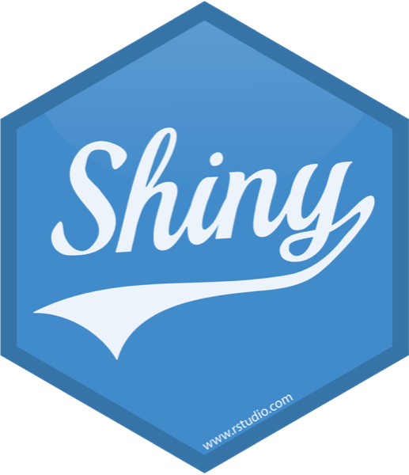
  
  
  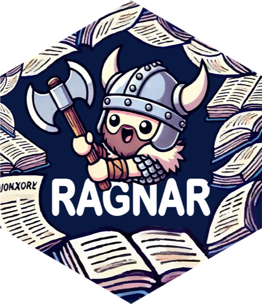
  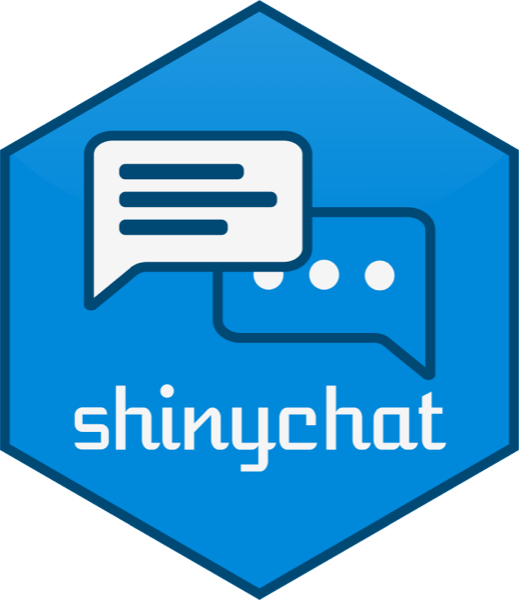
  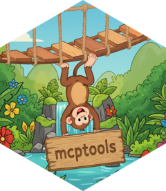
  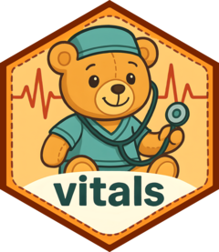
</div>
```

<div class="title-block">
<div class="eyebrow">posit::conf(2026)</div>
<div class="title-lockup">
<div class="hx hx-blue hx-r" aria-hidden="true"><div class="hx-in">R</div></div>
<h1>AI Agents<br><span>Deserve R</span></h1>
</div>
<div class="byline"><span>James Wade</span>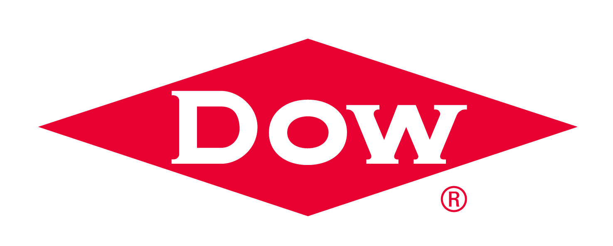</div>
</div>

::: {.notes}
Welcome everyone. I am James Wade.

Pause. Let the title sit for a beat before advancing.
:::

## {.question-slide .dark}

<div class="question">Am I missing out?</div>

::: {.notes}
For the last couple of years, nearly every time I had an idea for an AI feature in an R application, I found myself asking some version of this question.

Is there an agent framework, a memory layer, an evaluation tool, or a workflow engine that everyone else already knows about? Am I making this harder because I am still working in R?

I suspect I am not the only R user who has felt that.
:::

## {.statement-slide}

<div class="kicker">I kept getting stuck on the same question.</div>

```{=html}
<div class="question-morph">
<div class="question-stem">Should I…</div>
<div class="question-window">
<div class="question-tail question-tail-python fragment current-visible" data-fragment-index="0">move this to Python?</div>
<div class="question-tail question-tail-claude fragment" data-fragment-index="1">
  <div class="claude-terminal">
    <div class="claude-prompt"><span aria-hidden="true">❯</span> just tell them to use</div>
    <div class="claude-lockup">
      <span class="claude-mascot" aria-hidden="true"> ▐▛███▜▌
▝▜█████▛▘
  ▘▘ ▝▝</span>
      <span>Claude Code?</span>
    </div>
  </div>
</div>
</div>
</div>
```

::: {.notes}
The interesting questions were about the people using the thing: What do they need? What should the agent be allowed to do? Where should a person stay in control?

But before I could work on those, I kept stopping to ask a boring infrastructure question: should I move this to Python?

[Advance] Eventually the question got worse: should I build this for R users at all, or should I just tell them to use Claude Code?

Pause again. I like Claude Code. The question is whether R users should have to leave the workflows they understand to use agents.
:::

## {#chosen-r .context-slide .dark}

<div class="kicker">You chose R for a reason</div>

<div class="context-ribbon">
  <div class="hx hx-blue"><div class="hx-in">domain<br>knowledge</div></div>
  <div class="hx hx-violet"><div class="hx-in">data</div></div>
  <div class="hx hx-green"><div class="hx-in">workflows</div></div>
</div>

<div class="context-line">You already know what good work looks like.</div>
<div class="tradeoff-main fragment fade-up">Bring agents into <span>that work</span>.</div>

::: {.notes}
Think about an R workflow you already use: the data you have cleaned, the checks you trust, the Shiny app your colleagues understand.

That is useful context for an agent. So is your judgment about what a good answer looks like.

Advance: I want to bring agents into that work. Learning another language can be valuable. It should be a choice we make for the problem, rather than a prerequisite for adding AI.
:::

## {.thesis-slide}

<div class="thesis dimmed">Agents do not need the largest ecosystem.</div>

<div class="thesis fragment fade-up">They need a <span>coherent</span> one.</div>

::: {.notes}
Agents do not need the largest ecosystem. They need a coherent one.

They need a clear path from a request, through tools and data, to a result a person can inspect and use. The interface is part of that path too.

I will show you something I am building, then the R pieces underneath it. That is the case I want to make.
:::

## {#catch-up .briefing-slide}

<div class="kicker">Something I wanted for myself</div>
<div class="briefing-main">Help me catch up.<br><span>Build a habit & get better as I use it.</span></div>

<div class="briefing-contract fragment fade-up">
  <span>What should I focus on?</span>
  <span>What should I keep for later?</span>
  <span>Where else might I use this?</span>
</div>

::: {.notes}
I follow more useful material than I can read. I wanted help deciding where to spend my attention, with a short path back to the source whenever I had a question.

Advance: these are the three things I want the application to help me do. Decide what to focus on, what to keep for later, and where else I might use what I have read.

The user need is the same whether the front door is a daily briefing or a feed reader.
:::

## {#missed-tuesday .signal-slide}

<div class="signal-question">What if I skipped Tuesday?</div>

```{=html}
<div class="week-strip" aria-label="Monday read, Tuesday unread, Wednesday today">
  <div class="briefing-day seen"><span>Mon</span><strong>read</strong></div>
  <div class="briefing-day missed"><span>Tue</span><strong>unread</strong></div>
  <div class="briefing-day today"><span>Wed</span><strong>today</strong></div>
</div>
<div class="signal-reveal fragment fade-up">
  <div class="attention-question">The important story might still be Tuesday’s.</div>
  <div class="attention-detail">Use what I have read to help me decide what to read next.</div>
</div>
```

::: {.notes}
A new day does not mean I have caught up. Tuesday's important story may still deserve my attention on Wednesday.

Advance: this is where the application matters. It can combine reading state with source material and help me choose what to open next.

Reading state tells the application what happened. It does not tell it that I agree with an article, or that I want its conclusions remembered.
:::

## {#demo .rill-still .rill-intro}

```{=html}
<div class="rill-intro-copy">
  <h3>Rill</h3>
  <p>A personal feed reader.</p>
</div>
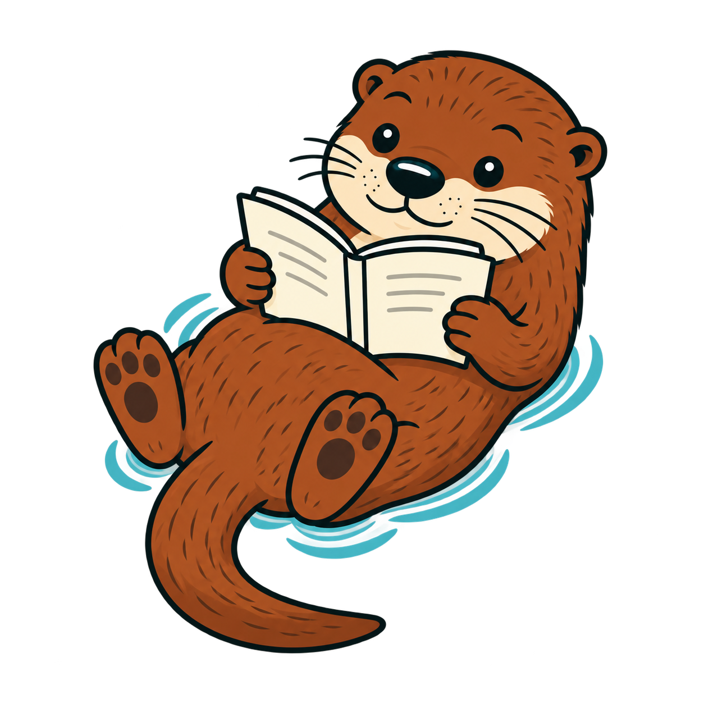
<figure class="rill-shot rill-queue-shot">
  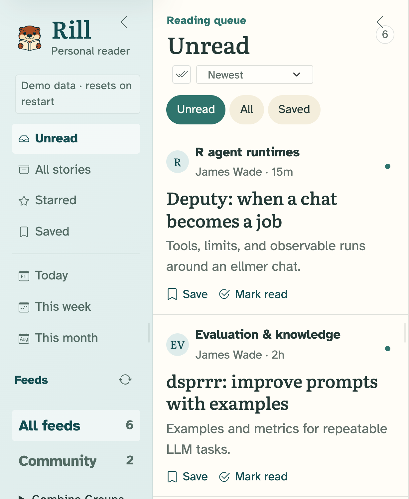
</figure>
```

::: {.notes}
This is Rill, a feed reader I am building for myself. These are screenshots from the app, using a small sample library and staged Orientation selections.

I still have an ordinary unread queue. I can read an article, save it, or open the original. The question is where to start when more has arrived than I have time to read.
:::

## {#demo-orientation .rill-still .orientation-overview}

```{=html}
<h3>Orientation</h3>
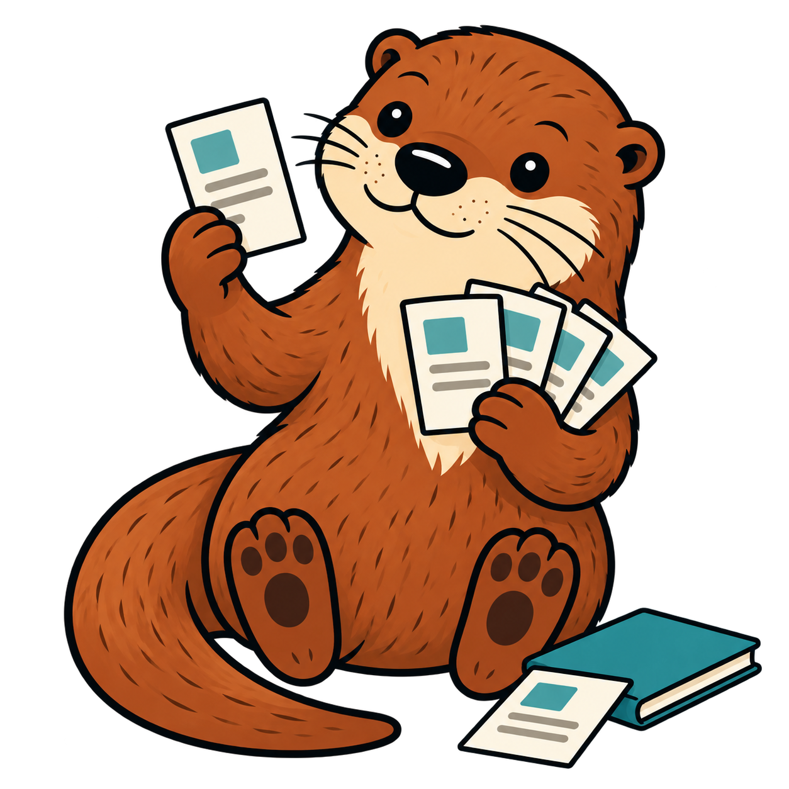
<div class="rill-cards" role="img" aria-label="Orientation selects two unread articles, Deputy and dsprrr, each with Rill's interpretation, a reason it matters now, and a link to its source evidence.">
  <article class="rill-card">
    <div class="rill-card-meta">James Wade · package documentation · 15m</div>
    <div class="rill-card-title">Deputy: when a chat becomes a job</div>
    <p class="rill-card-interp"><span>Rill interpretation</span>Deputy can run behind a shinychat interface, with tool permissions and run limits.</p>
    <p class="rill-card-why"><span>Why now</span>Useful for adding an agent to an existing Shiny app.</p>
    <div class="rill-card-foot"><span class="rill-card-evidence">▸ Source evidence and provenance [01]</span><span class="rill-card-dismiss">✕ Not for me</span></div>
  </article>
  <article class="rill-card">
    <div class="rill-card-meta">James Wade · package documentation · 2h</div>
    <div class="rill-card-title">dsprrr: improve prompts with examples</div>
    <p class="rill-card-interp"><span>Rill interpretation</span>dsprrr uses examples and a metric to improve an LLM program.</p>
    <p class="rill-card-why"><span>Why now</span>Useful when the same LLM task runs repeatedly.</p>
    <div class="rill-card-foot"><span class="rill-card-evidence">▸ Source evidence and provenance [02]</span><span class="rill-card-dismiss">✕ Not for me</span></div>
  </article>
</div>
<div class="rill-source-label">Rill · <a href="https://github.com/JamesHWade/rill">github.com/JamesHWade/rill</a> · redrawn from the app at slide scale</div>
```

::: {.notes}
This is the part I care most about: deciding what deserves my attention before I start reading. The app is redrawn at slide scale so you can read it from the back.

Orientation selects a few unread articles and explains each choice. Here it picked Deputy for the Shiny integration, and dsprrr for improving a task that runs repeatedly. I can open either article or dismiss a selection. The rest of the queue is still there, grouped into themes.

The unit of work is this set of choices. Is it useful? Did it miss something? Those are questions I can collect examples of and evaluate.
:::

## {#demo-evidence .rill-still .orientation-evidence}

```{=html}
<h3>A reason to read it</h3>
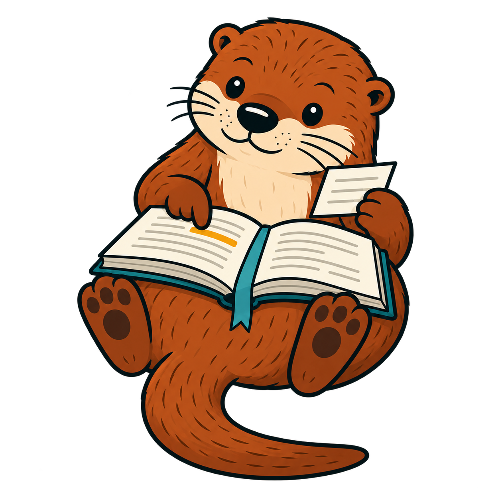
<div class="rill-cards rill-cards-single" role="img" aria-label="The Deputy selection with its source evidence expanded: Rill's interpretation, the quoted passage that supports it, the original source link, and the captured document identity.">
  <article class="rill-card rill-card-open">
    <div class="rill-card-title">Deputy: when a chat becomes a job</div>
    <p class="rill-card-interp"><span>Rill interpretation</span>Deputy can run behind a shinychat interface, with tool permissions and run limits.</p>
    <div class="rill-card-evidence rill-card-evidence-open">▾ Source evidence and provenance [01]</div>
    <blockquote class="rill-card-quote">or pass the Agent directly to <code>shinychat::chat_server()</code>.</blockquote>
    <dl class="rill-card-prov">
      <dt>Original source</dt><dd>jameshwade.github.io/deputy/</dd>
      <dt>Captured document</dt><dd><code>8435…c697</code> · 2026-09-11 09:55 UTC</dd>
      <dt>Limitations</dt><dd>Bundled demo content cannot support real-world claims.</dd>
    </dl>
  </article>
</div>
<div class="rill-source-label">Rill · <a href="https://github.com/JamesHWade/rill">github.com/JamesHWade/rill</a> · redrawn from the app at slide scale</div>
```

::: {.notes}
The reason is part of the selection. Here, the claim about using Deputy with Shiny has a passage I can check.

The quote and source stay attached to the selection. The interpretation stays distinguishable from what the source actually says. A useful Orientation needs to choose worthwhile material and explain those choices faithfully. Both belong in how I evaluate the program.
:::

## {#demo-review .rill-still .orientation-feedback}

```{=html}
<h3>Was this Orientation useful?</h3>
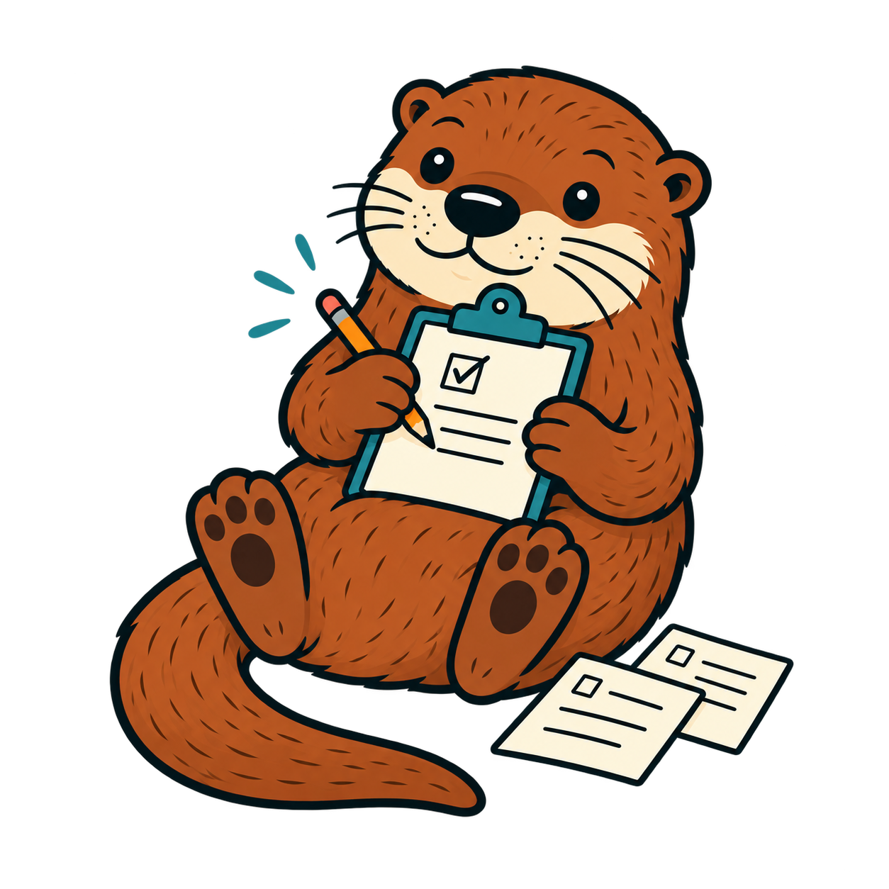
<div class="rill-cards rill-cards-single" role="img" aria-label="A reopened Helpful rating for the Orientation ‘What should I read before adding agents to Shiny?’, with the exact rated output available to review, and the saved reader comment: These are two things I can try in my next Shiny app.">
  <article class="rill-card rill-card-rating">
    <div class="rill-rating-label">Was this helpful?</div>
    <div class="rill-rating-options">
      <span class="rill-radio rill-radio-on"><i></i>Helpful</span>
      <span class="rill-radio"><i></i>Not helpful</span>
    </div>
    <div class="rill-card-evidence rill-card-evidence-open">▾ Review the exact output being rated</div>
    <p class="rill-rating-question"><span>Question</span>What should I read before adding agents to Shiny?</p>
    <p class="rill-rating-picks"><span>Selections</span>Deputy: when a chat becomes a job · dsprrr: improve prompts with examples</p>
  </article>
  <article class="rill-card rill-card-comment">
    <div class="rill-rating-label">Why?</div>
    <p class="rill-comment-text">These are two things I can try in my next Shiny app.</p>
    <div class="rill-comment-saved">Saved with the rating · selections and sources attached</div>
  </article>
</div>
<div class="rill-source-label">Rill · <a href="https://github.com/JamesHWade/rill">github.com/JamesHWade/rill</a> · redrawn from the app at slide scale</div>
```

::: {.notes}
Here I am rating the Orientation itself. These selections helped me decide what to try, so I marked them helpful and left a reason.

Rill keeps the rating with the exact selections and their sources. This is explicit feedback about usefulness. Opening an article would not tell me the same thing.

Reading an article, seeing an interpretation, and keeping a conclusion are different decisions. Keeping one should be an explicit choice with its source attached, and I should be able to change my mind.

For optimization, I would curate examples from this feedback, with the full unread set that was available each time. Saving a rating does not change the program by itself.

I will come back to this task once you have seen the packages underneath.
:::


## {#demo-ask .rill-still .rill-answer}

```{=html}
<h3>Questions while reading</h3>
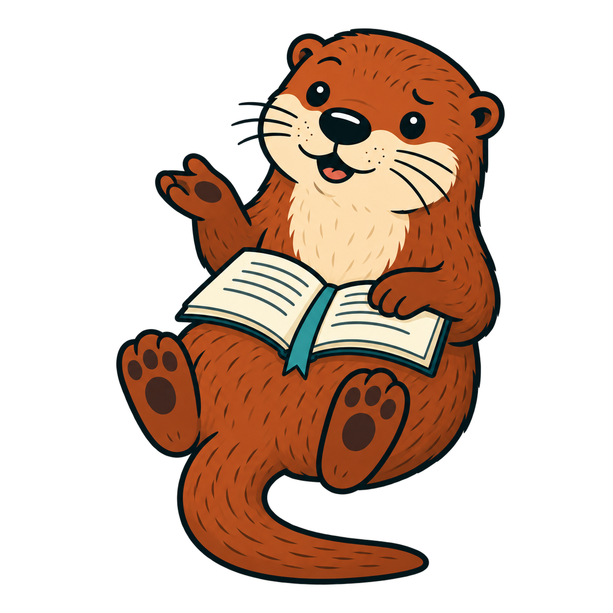
<div class="rill-cards rill-cards-single" role="img" aria-label="Ask Rill, grounded in the selected Deputy article. The reader asks, Can I use Deputy with shinychat? After a Source Document tool call, the answer says to pass the Agent to shinychat::chat_server(), using ellmer’s Chat protocol.">
  <article class="rill-card rill-card-chat">
    <div class="rill-chat-grounding">
      <span class="rill-chat-grounding-label">Grounded in this reading copy</span>
      <span class="rill-chat-grounding-title">Deputy: when a chat becomes a job</span>
    </div>
    <div class="rill-chat-user">Can I use Deputy with shinychat?</div>
    <div class="rill-chat-tool"><span class="rill-chat-tool-dot"></span>Source Document <span class="rill-chat-tool-chev">›</span></div>
    <div class="rill-chat-answer">
      <p>Yes. Pass the Agent to <code>shinychat::chat_server()</code>.</p>
      <p>Deputy implements ellmer’s Chat protocol, so the chat interface uses the same runtime as <code>run_sync()</code> and <code>run_async()</code>.</p>
    </div>
  </article>
</div>
<div class="rill-source-label">Rill · <a href="https://github.com/JamesHWade/rill">github.com/JamesHWade/rill</a> · redrawn from the app at slide scale · scripted answer</div>
```

::: {.notes}
Once I have chosen an article, I can also ask a question while reading it. Here I ask whether Deputy works with shinychat.

The question is attached to the selected article. The Source Document tool reads that copy, and its result is inspectable. This capture uses a scripted answer.

This is a supporting interaction in Rill. Shinychat supplies the conversation interface; the application supplies the selected source and tools.
:::

## {#r-program .r-program .accent-bg}

<div class="program-small">Start to finish,</div>
<div class="program-large">that was an R program.</div>

```{=html}
<div class="program-comb" role="img" aria-label="Tessellated hex stickers for six packages used by Rill: Shiny, bslib, shinychat, httr2, ellmer, and Deputy.">
  <div class="program-comb-row">
    
    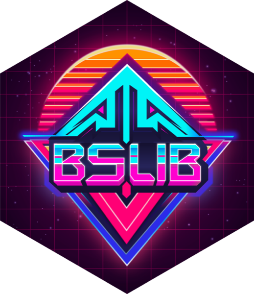
    
  </div>
  <div class="program-comb-row">
    
    
    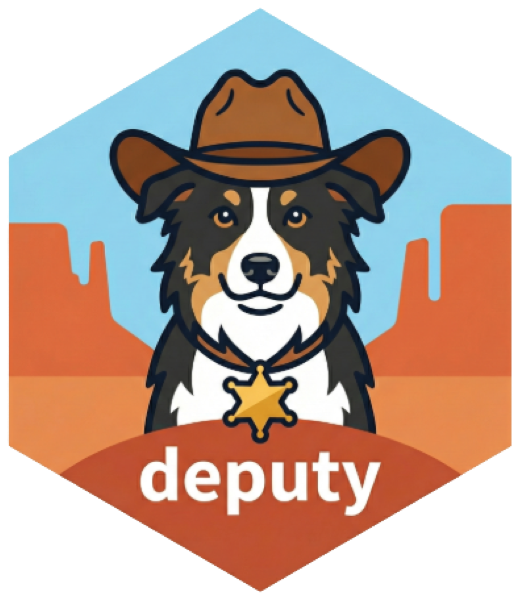
  </div>
</div>
```

::: {.notes}
The application brings together Shiny, bslib, and shinychat for the interface, httr2 for HTTP requests, ellmer for model access, and Deputy for managed agent runs. These are six of Rill's declared dependencies.

The selection process is an R program with a defined input and a result I can inspect. That means I can collect examples, decide what good work looks like, and test changes to the program. I will come back to that. First, the part of the app you saw most: the interface.
:::

## {#ode-to-shinychat .ode-title .dark}

```{=html}
<div class="ode-title-copy">
  <div class="ode-pretitle">An ode to</div>
  <h1>shinychat</h1>
</div>

<div class="ode-credit">
  <strong>Thank you, shinychat.</strong>
  <span>Carson Sievert · Garrick Aden-Buie · Joe Cheng · Barret Schloerke<br>and everyone who contributes to shinychat</span>
</div>
```

::: {.notes}
I want to take a minute to thank the people behind shinychat. Carson, Garrick, Joe, Barret, and everyone who contributes: I've built a lot on top of your work.

History, thinking traces, tool calls, slash commands, a drawer for my own Shiny UI. There is a lot in this package. Let me show you a few things I appreciate.

These screenshots use shinychat with a sample conversation I wrote for the talk.
:::

<!-- reference notes (not shown in presenter view)
Sources: screenshots captured with https://github.com/posit-dev/shinychat/blob/826c799994c32611629236bbc73516dbc14ff2ab/pkg-r/DESCRIPTION, R package version 0.5.0, on September 11, 2026. The code examples were checked against development revision 88f7625846b096b6e0b2f88358969b854602e022, version 0.5.0.9000, on September 13, 2026. The logo is the deck's original shinychat asset.
-->

## {#shinychat-history .ode-feature .ode-history}

```{=html}
<h3>Conversation history</h3>
<p class="ode-deck">Search for an old chat. Fork your session. Manage state in your shiny app.</p>
<div class="ode-history-grid">
  <figure class="ode-history-sidebar">
    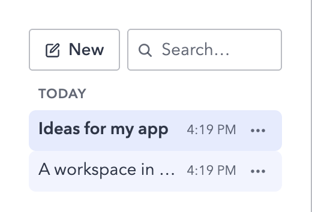
  </figure>
  <figure class="ode-history-branch">
    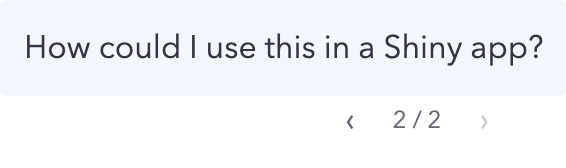
  </figure>
</div>
<div class="ode-history-payoff">Enjoy the perks of persistence out of the box.</div>
<div class="ode-capture-label">shinychat · real UI, scripted sample</div>
```

::: {.notes}
I can name a conversation, search for it, and come back to it later.

Here's a detail I like: if I edit a question, shinychat keeps the original. See that little two-of-two control? I can use it to go back to the first version.
:::

<!-- reference notes (not shown in presenter view)
Technical note: the app chooses where to store conversations and who can access them. This demo uses memory. File storage and other backends can keep history across sessions.

Sources: https://github.com/posit-dev/shinychat/blob/826c799994c32611629236bbc73516dbc14ff2ab/pkg-r/R/chat_history.R; pkg-r/R/chat_history_store.R; js/src/chat/ChatHistoryDrawer.tsx; js/src/chat/ChatMessage.tsx at the same revision.
-->

## {#shinychat-visuals .ode-feature .ode-activity}

```{=html}
<h3>Thinking traces and tool calls</h3>
<div class="ode-activity-stage">
  <figure class="ode-activity-frame fragment fade-out" data-fragment-index="0">
    <div class="ode-feature-name">Thinking traces</div>
    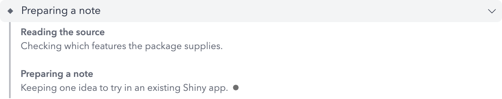
    
    <figcaption>You can stop a reply as it streams.</figcaption>
  </figure>
  <figure class="ode-activity-frame fragment current-visible" data-fragment-index="0">
    <div class="ode-feature-name">Tool calls</div>
    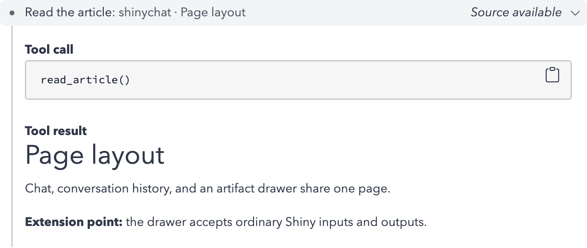
    <figcaption>Inspect a tool call and understand how an agent is using it.</figcaption>
  </figure>
</div>
<div class="ode-capture-label">shinychat · real UI but a scripted sample</div>
```

::: {.notes}
When the model provides a thinking trace, shinychat has a place to show it. I can expand it or leave it folded up. The reply streams in, I can stop it, and I can keep typing while I wait.

[Advance once.] Tool calls have their own display too. I can open one to see the request and what came back. And I can customize the title, preview, and result display.
:::

<!-- reference notes (not shown in presenter view)
Technical note: these examples use scripted content. Thinking traces depend on what the model provider makes available. The companion app also has a source-aside example, with source details supplied by the app.

Sources: https://github.com/posit-dev/shinychat/blob/826c799994c32611629236bbc73516dbc14ff2ab/pkg-r/R/chat.R (Thinking and Asides sections); pkg-r/R/contents_shinychat.R (ContentThinking adapter and tool_result_display); js/src/chat/ThinkingDisplay.tsx; js/src/chat/ToolGroup.tsx at the same revision.
-->

## {#shinychat-commands .ode-feature .ode-commands}

```{=html}
<h3>Slash commands</h3>
<p class="ode-deck">Type / to run one of your own commands.</p>
```

:::: {.ode-command-grid}
::: {.ode-command-shot}
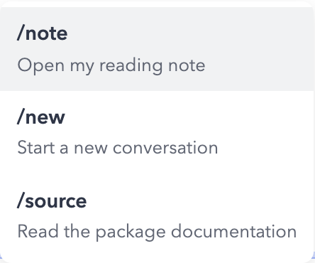{fig-alt="The native slash-command palette offers /note to open a reading note, /new to start a conversation, and /source to open documentation."}
:::

::: {.ode-command-code}
```r
handle$slash_command(
  "note", "Open my reading note",
  function() {
    chat_drawer_show("reader")
  },
  echo = FALSE
)
```
:::
::::

<div class="ode-command-payoff">Here, /note opens the drawer.</div>
<div class="ode-capture-label">shinychat · real UI with app-defined commands</div>

::: {.notes}
Type slash and your commands show up.

I decide what they do. Here, slash-note runs this R function and opens my reading note. That's a handy way to put an app action right in the chat.
:::

<!-- reference notes (not shown in presenter view)
Technical note: handle is the object returned by handle <- chat_server("reader", client = chat); chat is the session's ellmer client. Register commands on handle. This handler uses echo = FALSE to open the drawer without adding a chat message or calling the model. Other commands can take arguments or prepare a prompt.

Source: https://github.com/posit-dev/shinychat/blob/88f7625846b096b6e0b2f88358969b854602e022/pkg-r/R/chat_app.R (slash_command registration and dispatch), pkg-r/R/content-slash-command.R, and js/src/chat/SlashCommandPalette.tsx at the same revision.
-->

## {#shinychat-drawer .ode-feature .ode-drawer}

```{=html}
<div class="ode-drawer-copy">
  <div class="ode-feature-name">The artifact drawer</div>
  <h3>And it’s<br>still <span>Shiny</span></h3>
  <p>Put your Shiny UI right beside the chat.</p>
  <div class="ode-extension-list">Forms · plots · tables · htmlwidgets</div>
</div>
<figure class="ode-drawer-shot">
  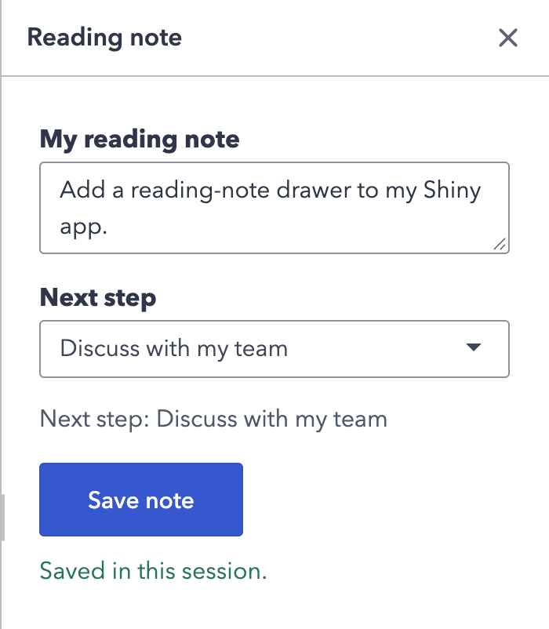
</figure>
<div class="ode-capture-label">shinychat drawer · ordinary Shiny UI inside</div>
```

::: {.notes}
And I can put my own Shiny UI in the drawer.

This is a small reading-note form. Change the next step, and the output updates. It's a Shiny input and a reactive output, just where you'd want them: beside the conversation. I could put a plot here, or a table, or an htmlwidget.

Shinychat provides the drawer; I wrote the form inside it. I can use the package's chat features and keep adding the Shiny code my app needs.
:::

<!-- reference notes (not shown in presenter view)
Technical note: use chat_drawer() in page_chat() or chat_ui(), then chat_drawer_show(), chat_drawer_update(), chat_drawer_hide(), or chat_drawer_toggle() from the server. The app handles saving the drawer's contents. This example saves the note for the current session. Source asides are a separate feature for showing supporting material beside a claim.

Sources: https://github.com/posit-dev/shinychat/blob/826c799994c32611629236bbc73516dbc14ff2ab/pkg-r/R/chat_drawer.R; pkg-r/R/page_chat.R; pkg-r/inst/examples-shiny/page-chat-drawer-controls/app.R. Custom tool-result UI can also extend contents_shinychat(), an S7 generic; see pkg-r/R/contents_shinychat.R and https://posit-dev.github.io/shinychat/r/articles/tool-ui.html.
-->

## {#shinychat .package-example .ode-code}

<div class="example-heading">
<h3>Add it to your Shiny app</h3>

</div>

```r
# In the UI
chat_ui("reader")

# In the server
handle <- chat_server("reader", client = chat)
```

<div class="ode-code-payoff">I can get on with building the reading assistant.</div>
<div class="example-version">shinychat development · 0.5.0.9000</div>

::: {.notes}
Here's where it starts: chat_ui() in the UI, and chat_server() connected to a chat client in the server.

History is enabled by default. Then I add my commands and the drawer's contents. There are greetings, suggestion cards, attachments, and source asides too. I haven't shown you everything.

That's a lot of UI code I don't have to write. I can get on with the reading assistant.

Now, what was behind that tool call? An R function.
:::

<!-- reference notes (not shown in presenter view)
Technical note: this assumes library(shinychat) and an ellmer chat client created inside the Shiny session. Use page_chat() for a full-window layout. chat_server() enables history by default; customize it with history_options() or disable it with history = FALSE. Register commands on handle and supply your own drawer contents. Rill and Tempest also adapt their agent streams to keep their product rules and Deputy controls active.

Sources: https://github.com/posit-dev/shinychat/blob/88f7625846b096b6e0b2f88358969b854602e022/pkg-r/R/chat_app.R and pkg-r/NEWS.md at the same revision; API reference: https://posit-dev.github.io/shinychat/r/reference/chat_app.html.
-->

## {#r-tool .package-example}

<div class="example-heading">
<h3>The agent asks to call an R function</h3>

</div>

```r
read_article <- tool(
  fun = function() article,
  name = "read_article",
  description = "Read this article and its source.",
  annotations = tool_annotations(
    read_only_hint = TRUE, open_world_hint = FALSE
  )
)
```

<div class="example-takeaway">Your existing R code becomes a capability the agent can use.</div>

::: {.notes}
When the agent opened the article, it asked the application to call an R function. This uses ellmer, with the article text and source already prepared by the application.

The model sees the tool's name and description and can request it. The application runs the function and returns the result.

Here the function reads an article. In your work it could query a database, run a model, or return a plot. Code you already know how to write and test becomes useful to an agent.

The annotations mark this function read-only and closed to the outside world. It returns the prepared article and never fetches the URL. Metadata alone cannot make arbitrary code safe.
:::

<!-- reference notes (not shown in presenter view)
The code assumes library(ellmer) and article already containing the reading text and its source. The function takes no arguments, so no argument schema is needed. tool() creates the tool; it does not call the model or register itself with a chat. Next, the same read_article tool is registered through Deputy's tools argument. With ellmer alone, use chat$register_tool(read_article), then chat$chat(question). This is a shortened teaching example of Rill's current-document tool; Rill also pins the immutable Document and its provenance. Deputy treats a missing open_world_hint as TRUE, so open_world_hint = FALSE is required for this tool under the read-only policy on the next slide, which disables web access.

Sources: https://github.com/tidyverse/ellmer/blob/92cfa7f48270048105ea1bfb44d23a2e59c2df6e/R/tools-def.R (ellmer 0.5.0.9000); https://github.com/JamesHWade/deputy/blob/12c60de84fe811fd784f9ffa6f9c64db143eb165/R/tool-registration.R and R/permissions.R at the same revision; Rill R/agent.R, rill_document_tool(). Development APIs checked September 13, 2026.
-->

## {#deputy .package-example}

<div class="example-heading">
<h3>Deputy gives the agent a job to do</h3>

</div>

```r
agent <- Agent$new(
  chat = chat,
  tools = list(read_article),
  permissions = Permissions(
    mode = "readonly", tool_allowlist = "read_article"
  ),
  usage_limits = UsageLimits(max_requests = 6)
)
result <- agent$run_sync(question)
```

<div class="example-takeaway">“What does this article demonstrate, and what is still unresolved?”</div>

::: {.notes}
Now I give the agent a job. Same ellmer chat client, same read_article tool. The question is about the article we just read.

Ellmer already supports tool calling. Deputy adds a managed run: permissions, hooks, usage limits, and an inspectable result. Here it gets a read-only policy that explicitly allows the article tool, and a limit of six model requests. The allowlist matters. A read-only annotation alone does not authorize a custom tool.

The result holds the response, tool activity, usage, and why the run stopped. Ordinary R objects I can inspect.

Orientation is the same kind of run. That is the task I said I would come back to.
:::

<!-- reference notes (not shown in presenter view)
The code assumes library(deputy), a session-specific chat client, and question set to the text below the code. This is a console example. A Shiny application uses the streaming integration so the interface stays responsive and the same permissions and limits remain active.

Sources: https://github.com/JamesHWade/deputy/blob/12c60de84fe811fd784f9ffa6f9c64db143eb165/R/permissions.R, R/agent.R, and vignettes/example-shiny-chat.Rmd at the same revision (Deputy 0.0.0.9000). Permissions() is an S7 constructor; Agent$new() remains the R6 constructor. Development APIs checked September 13, 2026.
-->

## {#dsprrr .package-example}

<div class="example-heading">
<h3>The Orientation task in dsprrr</h3>
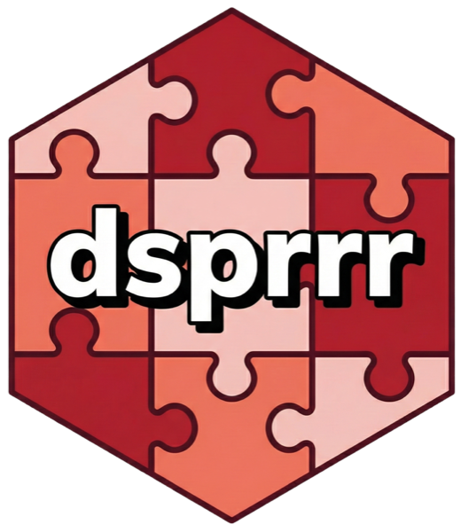
</div>

```r
orient <- module(
  signature(
    "unread -> selections, reasons, evidence, themes"
  )
)
```

<div class="example-takeaway">The task stays the same across different unread sets.</div>

::: {.notes}
Back to the Orientation feedback from earlier. Here is how I would express that task in dsprrr. The unread articles are the input. The selections, reasons, supporting evidence, and themes are the output.

That gives me a repeatable unit I can run across examples from different days. I can change its instructions or demonstrations and ask whether the selections became more useful.
:::

<!-- reference notes (not shown in presenter view)
This is a simplified teaching interface. Rill currently generates Orientation through a Deputy run with a bounded candidate tool and a validated submission. An implementation would preserve the structured output, source checks, and candidate boundary when adapting the selection step to dsprrr.

The code assumes library(dsprrr). module() creates a prediction module directly; it no longer accepts type = "predict". The short signature uses string fields to keep the example readable; a complete adapter would use structured types for the selections and themes. No dsprrr optimization result is shown in these screenshots.

Sources: https://github.com/JamesHWade/dsprrr/blob/76a014f74e8d4a236aa0a0c5dda87de388310cf6/R/module.R and R/signature.R at the same revision (dsprrr 0.0.0.9000); Rill R/orientation-agent.R and R/orientation.R. Development APIs checked September 13, 2026.
-->

## {#dsprrr-improve .package-example}

<div class="example-heading">
<h3>Improving the Orientation program</h3>

</div>

```r
candidate <- compile(
  orient,
  MIPROv2(metric = score_orientation),
  trainset = examples,
  valset = validation,
  .llm = chat
)
```

<div class="example-takeaway">Compare with the original on unread sets kept out of optimization.</div>

::: {.notes}
MIPROv2 searches over instructions and demonstrations. I supply examples and the metric that defines a better Orientation.

I care whether the choices help me decide what to read and whether the reasons are supported by their sources. Quotes and document IDs can be checked in code. Usefulness needs a rubric informed by reader judgments. My score_orientation function would combine those. It is application code, not a built-in metric.

This is the workflow I want around Orientation. The app already retains feedback. Assembling the evaluation data and running the comparison are further work, so there are no before-and-after scores to claim.
:::

<!-- reference notes (not shown in presenter view)
The examples and validation set guide the search. Then I compare the candidate and the original on another set that the optimizer never saw. I would keep a change only if it improves that comparison, with acceptable cost and latency.

The code assumes the orient module from the previous slide, an ellmer chat client, curated examples and validation data, and a numeric score_orientation(prediction, row) function. Evaluation uses evaluate(orient, testset, metric = score_orientation, .llm = chat), then the same call with candidate.

Sources: https://github.com/JamesHWade/dsprrr/blob/76a014f74e8d4a236aa0a0c5dda87de388310cf6/R/compile.R, R/teleprompter-mipro.R, R/evaluate.R, and vignettes/tutorial-optimize-your-module.Rmd at the same revision. compile() takes the program first and the optimizer second. Development APIs checked September 13, 2026.
-->


## {#staying-in-r .gap-slide .cohesion-slide}

```{=html}
<div class="cohesion-copy">
  <h3>The pieces fit the work.</h3>
  <article class="rill-card rill-card-chat cohesion-recap">
    <div class="rill-chat-grounding">
      <span class="rill-chat-grounding-label">Questions while reading</span>
      <span class="rill-chat-grounding-title">Deputy: when a chat becomes a job</span>
    </div>
    <div class="rill-chat-user">Can I use Deputy with shinychat?</div>
    <div class="rill-chat-tool"><span class="rill-chat-tool-dot"></span>Source Document<span class="rill-chat-tool-chev">›</span></div>
    <div class="rill-chat-answer"><p>Yes. Pass the Agent to <code>shinychat::chat_server()</code>.</p></div>
  </article>
  <p class="cohesion-caption">Rill · the reading interaction from earlier</p>
</div>
<div class="package-map cohesion-map cohesion-map-app" role="img" aria-label="Six Rill dependencies in fixed positions: Shiny, shinychat, bslib, httr2, Deputy, and ellmer. Rill’s reading otter sits at the center.">
  
  
  
  
  
  
  <div class="map-rill" aria-hidden="true"><span>Rill</span></div>
</div>
```

::: {.notes}
Back in Rill, this is what those pieces add up to: I can ask a question while reading, with the source close at hand.

Shiny and shinychat provide the interface. Ellmer makes my R function a tool. Deputy manages the run. I supply the article, the application rules, and the judgment about whether the result is useful.

The dsprrr example showed how I would improve another task in this same app. That is further work, not something this chat already does.

I started by asking whether I needed to leave R. Here I can build the reading assistant around code and work I already understand.
:::

<!-- reference notes (not shown in presenter view)
Technical note: the chat excerpt repeats the scripted answer shown earlier. The six hexes are Rill dependencies, also shown on “that was an R program”; dsprrr is deliberately outside this deployed composition. Rill supplies its own streaming adapter to retain source context, permissions, and run controls.

Sources: Rill DESCRIPTION and R/agent.R; the earlier Rill, shinychat, ellmer, and Deputy example notes.
-->

## {#cran .gap-slide .cohesion-slide}

```{=html}
<div class="cohesion-copy coherence-copy">
  <h3>This is what<br><span>coherent</span><br>looks like.</h3>
  <p>The agent reads the article.<br>I can inspect exactly what it read.</p>
  <p class="cohesion-conventions">CRAN reinforces shared habits:<br>documentation, dependencies,<br>and package checks.</p>
</div>
<div class="package-map cohesion-map cohesion-map-connection" role="img" aria-label="Six Rill dependencies in fixed positions: Shiny, shinychat, bslib, httr2, Deputy, and ellmer. Shinychat, Deputy, and ellmer are emphasized for carrying the article tool result from the agent run into an inspectable source panel.">
  
  
  
  
  
  
  <div class="map-rill" aria-hidden="true"><span>Rill</span></div>
</div>
```

::: {.notes}
This is what I mean by a coherent ecosystem. The agent reads the article through an ellmer tool. Deputy runs the agent. Rill takes the returned source record and displays it in shinychat, next to the answer.

That Source Document panel holds the title, source link, capture details, limitations, and the original tool result. I can inspect the same captured article the agent read.

Around those connections are shared habits for working with other people's code: documentation I can learn from, declared dependencies, and checks I can run. CRAN makes many of those expectations concrete.

Those habits show me how the pieces fit and where my own code belongs, even while a package is still in development.
:::

<!-- reference notes (not shown in presenter view)
Technical note: rill_document_tool() returns the pinned Document, including markdown and provenance. rill_reader_agent() registers it with Deputy. rill_agent_shiny_stream() uses run_shiny() or stream_async(); track_reader_agent_stream() passes ellmer content through reader_tool_result_display(), which attaches display HTML while preserving the tool result. append_reader_chat() sends that stream to shinychat::chat_append(). This is Rill's explicit integration, not a claim that chat_server() alone builds the source panel or guarantees a faithful answer. The panel includes the original tool-result JSON for inspecting the returned article text. CRAN does not define this interface, guarantee agent safety or answer quality, or host every package shown.

Sources: Rill R/agent.R, rill_document_tool(), rill_reader_agent(), rill_agent_shiny_stream(), reader_tool_result_display(), track_reader_agent_stream(), and append_reader_chat(); R/server.R, the reader-question stream setup; inspected at local commit 7769879 on September 12, 2026, with those files clean. https://cran.r-project.org/doc/manuals/r-release/R-exts.html.
-->

## {#smaller-map .gap-slide .dark}

```{=html}
<div class="gap-copy">A smaller map<br>makes gaps<br><span>visible.</span></div>
<div class="package-map cohesion-map cohesion-map-gap" role="img" aria-label="A wider map of the ellmer ecosystem: vitals, shinychat, ragnar, btw, Deputy, and ellmer. An open center marked with a question mark represents a capability still to build.">
  
  
  
  
  
  
  <div class="hx map-gap" aria-hidden="true"><div class="hx-in">?</div></div>
</div>
```

::: {.notes}
Once I can see how the pieces fit, I can see what I still want to build. Ellmer, shinychat, and Deputy stay in place as the map opens out. Vitals gives me evaluation, ragnar brings retrieval, btw supplies tools and context from R. The open center is a capability I still want.

This is a map of pieces I can build with, not a list of packages already running in the reading interaction.

Improving Orientation from examples was one such gap. I could describe the task in R and look for a way to improve it.

Sometimes the missing idea already exists in another ecosystem. DSPy was one. I can bring that idea back and give it an R interface.
:::

<!-- reference notes (not shown in presenter view)
Sources: https://vitals.tidyverse.org/; https://ragnar.tidyverse.org/; https://posit-dev.github.io/btw/. Package roles checked September 12, 2026. Btw is an example of the surrounding ecosystem, not a claim of an existing Rill integration.
-->

## {#good-idea-elsewhere .translation-slide}

```{=html}
<div class="translation-flow">
  <div class="translation-from">good idea elsewhere</div>
  <div class="translation-arrow" aria-hidden="true">→</div>
  <div class="translation-to">R-shaped implementation</div>
</div>
<div class="translation-packages" aria-label="Packages I have been building">
  
  
  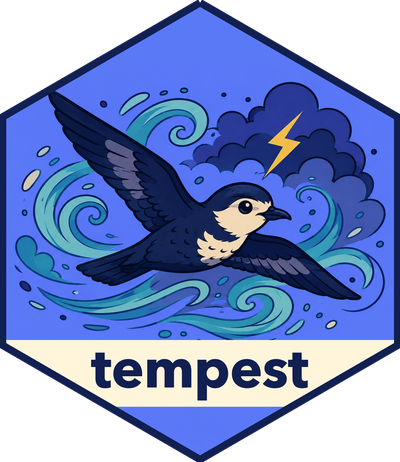
  
  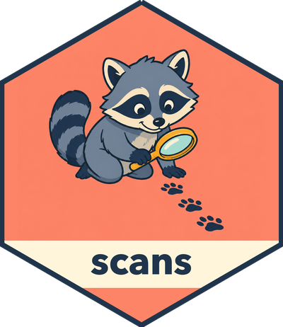
</div>
<div class="translation-caption">Coding agents can help with the implementation.<br>You still choose the interface.</div>
```

::: {.notes}
These are packages I have been building. dsprrr brings ideas from DSPy into R. Tempest implements STORM and Co-STORM research workflows. scans draws on inspect_scout for examining agent trajectories.

Deputy and Graft are also part of that work: a managed agent run around ellmer, and reviewed, versioned knowledge that agents can read.

Coding agents help me study an idea, try an implementation, and test it. Deciding what belongs in R and what a good R interface feels like still takes domain knowledge and taste.
:::

<!-- reference notes (not shown in presenter view)
Sources: dsprrr README.md (DSPy), Tempest README.md (STORM and Co-STORM), scans README.md (inspect_scout), Deputy README.md, and Graft README.md. New sticker artwork comes from each package's man/figures/logo.png.
-->

## {#missing-out-answer .gap-slide .answer-slide .dark}

```{=html}
<div class="gap-copy answer-copy">
  <div class="answer-question">Am I missing out?</div>
  <div class="answer-main fragment fade-up" data-fragment-index="1">Less than I feared.</div>
  <div class="answer-detail fragment fade-up" data-fragment-index="2">Small enough to see the gap.<br>Coherent enough to fill it.</div>
</div>
<div class="package-map cohesion-map cohesion-map-gap" role="img" aria-label="The same ellmer ecosystem map from earlier: vitals, shinychat, ragnar, btw, Deputy, and ellmer. The open center marked with a question mark flashes through Rill, Deputy, Tempest, Graft, and scans, then settles on the dsprrr hex sticker.">
  
  
  
  
  
  
  <div class="hx map-gap fragment fade-out" data-fragment-index="2" aria-hidden="true"><div class="hx-in">?</div></div>
  <div class="map-cycle fragment" data-fragment-index="2" aria-hidden="true">
    <div class="map-frame map-frame-rill"><span>Rill</span></div>
    
    
    
    
    
  </div>
</div>
```

::: {.notes}
This is the question I started with, next to the map from a few slides ago. The center is still open.

Advance: less than I feared. The pieces I needed were already in R, or a translation away.

Advance: the open center has been filled more than once. Rill, Deputy, Tempest, Graft, scans, and dsprrr for the Orientation gap. A map this size is small enough to see the gap, and coherent enough to fill it.
:::

<!-- reference notes (not shown in presenter view)
The map is the same one from the smaller-map slide. The center runs one pass through the things I have built and rests on dsprrr. The claim is about the ecosystem, not about any package being finished. Let the pass finish before speaking the last line.
-->

## {.closing-slide .dark}

```{=html}
<div class="sticker-pile" aria-hidden="true">
  
  
  
  
  
  
  
  
  
</div>
```

<div class="closing-first">Keep your hex stickers.</div>
<div class="closing-last">Bring your agents with you.</div>

<div class="closing-name"><div class="closing-affiliation"><span>James Wade · posit::conf(2026)</span></div><a href="https://github.com/JamesHWade/rill">github.com/jameshwade/rill</a><br><a href="https://github.com/jameshwade/deputy">github.com/jameshwade/deputy</a><br><a href="https://jameshwade.github.io/dsprrr/">jameshwade.github.io/dsprrr</a></div>

::: {.notes}
Both lines are on screen. Say them, or let them sit.

Pause. Thank the audience.
:::
